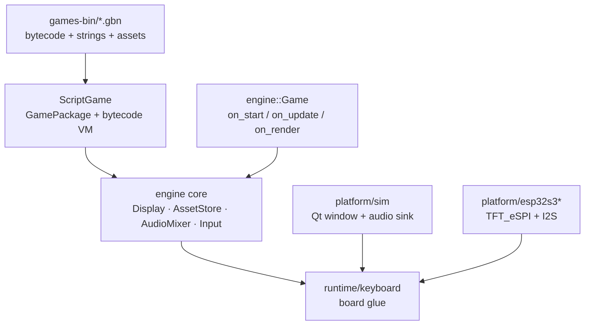

# FunAIGameEngine

**A cartridge-based 2D game engine for ESP32-S3 and the desktop.**
One firmware, many games: a game is a single `.gbn` file that contains the bytecode *and*
every asset it needs. Swap the file, not the firmware.

**v1.0.1** · C++17 · LVGL 8.3.x · ESP32-S3 + Windows simulator

---

## The idea

In most embedded game projects the game *is* the firmware: a new game means a rebuild, a
reflash, and a separate binary for every board. This engine inverts that:

| | |
|---|---|
| **Firmware** | Built once. Holds the engine and nothing game-specific. |
| **Cartridge (`.gbn`)** | One file = bytecode + strings + sprites + sounds. |
| **Shipping a game** | Copy a file into `data/`, add one line to the on-device shelf. |

The same engine core compiles for the Windows simulator and for the ESP32, so a game that
plays correctly on the desktop plays identically on hardware — the platform differences are
absorbed by `platform/` and `runtime/`.

## Features

- **Bytecode VM + cartridge container.** The `.gbn` file is parsed *zero-copy*: the asset
  table points straight into the loaded buffer, so nothing is duplicated in RAM.
- **Two ways to write a game.**
  A small statically-typed scripting language (`game.gs`, compiled to bytecode) for games
  that ship as cartridges; or native C++ implementing one `engine::Game` subclass.
- **Display through LVGL.** The engine renders into a full-screen `lv_canvas`; games may
  also use LVGL widgets directly.
- **Standardised input.** Up/Down/Left/Right + A/B/C/D + Start/Select + L/R + X/Y, with
  identical semantics on simulator and hardware.
- **Rate-aware audio mixer.** 1 looping BGM voice + 6 SFX voices. Every clip carries its own
  sample rate and the mixer resamples on the fly (see [Hard limits](#hard-limits)).
- **Two sprite formats, chosen automatically.** RGB565 for large/colourful images, 4bpp
  indexed for small ones — the packer picks per image.
- **Dependency-free asset pipeline.** PNG decode, WAV resample and image packing are written
  against the Python standard library only. No Pillow, no numpy, no ffmpeg.
- **Ships as a normal Arduino library.** `engine/` has `library.properties`, `library.json`,
  `src/`, `examples/` and `keywords.txt`; LVGL is the only external dependency.
- **Offline iteration tooling.** A reference VM with a software framebuffer, engine-accurate
  screenshots, compiler tracebacks and a hang locator, so most work happens without flashing.

## Architecture at a glance



`engine::Game` is the **only** game interface. A script cartridge and a native C++ game are
just two implementations of it; the platform layer neither knows nor cares which one is in
use. Full layered description: [`docs/ENGINE_ARCHITECTURE.md`](docs/ENGINE_ARCHITECTURE.md).

## Repository layout

| Path | What it is |
|---|---|
| `engine/` | **The engine, and the publishable unit** — a standard Arduino library (`src/engine/*.h` next to `*.cpp`, plus `library.properties` / `library.json` / `examples/`) |
| `games/` | Native C++ games + `registry.cpp`. Kept as the **spec reference** for the script ports; the keyboard firmware links none of them |
| `games-src/<name>/` | Script game sources: `game.gs` plus its art/audio |
| `games-bin/<name>.gbn` | Built cartridges — what the simulator and the firmware actually load |
| `assets-src/`, `assets-packed/` | Original art (`.png`/`.wav`) and packed output (`.img`/`.snd`) |
| `platform/sim/` | Windows simulator: Qt window, LVGL driver, audio sink |
| `platform/esp32s3/`, `platform/esp32s3keyboard/` | Export templates for real hardware |
| `runtime/keyboard/` | Board-side runtime: `read_pad`, audio backend, lifecycle |
| `tools/` | The whole offline toolchain (Python 3, standard library only) |
| `docs/` | Detailed documentation (**currently written in Chinese**) |
| `third_party/lvgl/` | Vendored LVGL 8.3.11 so the build never needs the network |

## Quick start (desktop simulator)

Requirements: CMake ≥ 3.16, a C++17 compiler, and Qt 6 **including the Multimedia module**.
On Windows the reference setup is Qt at `C:\Qt\6.9.3\mingw_64` with the MinGW 13.1 toolchain.

```bat
cd F:\New_Project\FunAIGameEngine

:: 1) generate the sample assets and pack them into assets-packed/
py -3 tools\engine.py gen-samples
py -3 tools\engine.py assets

:: 2) configure + build the simulator (drop --qt-dir if you use Qt Creator instead)
py -3 tools\engine.py configure --qt-dir C:/Qt/6.9.3/mingw_64
py -3 tools\engine.py build

:: 3) play
py -3 tools\engine.py run skyraider
```

The simulator window is **428×142**, matching the NV3007 panel used on the reference
keyboard. Arrow keys move, `A` fires, `B` is the special, `Esc` quits.

A bare `fun_sim.exe` needs the Qt DLLs on `PATH` (otherwise it exits immediately with
`0xC0000135`), so prefer launching it through `engine.py run` or `tools\sim_shot.py`,
both of which set the environment up for you.

## Run a cartridge

```bat
py -3 tools\engine.py pack starfall                   :: -> games-bin/starfall.gbn
py -3 tools\engine.py run games-bin\starfall.gbn      :: simulator loads the .gbn directly
```

Everything the CLI understands:

| Command | Purpose |
|---|---|
| `gen-samples` | Generate the sample art/audio |
| `assets` | Pack `assets-src/` → `assets-packed/` |
| `configure --qt-dir <path>` | Configure the CMake build |
| `build` | Build the simulator |
| `run [game\|cart.gbn]` | Run a game id, or a cartridge file |
| `new <name>` | Scaffold a native C++ game from the template |
| `pack <name>` | Compile + pack a script game into a `.gbn` |
| `export <name> [--target esp32s3]` | Export to a PlatformIO project |
| `targets` | List the available hardware targets |

## Make a new game (script route)

```bat
:: 1) a game is a folder: game.gs + its assets
mkdir games-src\mygame
::    games-src\mygame\game.gs
::    games-src\mygame\player.png
::    games-src\mygame\coin.wav

:: 2) compile + pack into one cartridge
py -3 tools\build_game.py mygame

:: 3) check the logic — reference VM, seconds per run
py -3 tools\gs_run.py games-src\mygame\game.gs --frames 600 --pad right,a ^
    --globals px,score,lives --png tools\_preview\mygame.png

:: 4) check the actual engine rendering
py -3 tools\sim_shot.py tools\_preview\sim_mygame.png mygame --zoom 2
```

A script game has exactly three entry points — `on start`, `on update`, `on render`.
The language is documented in [`docs/SCRIPT.md`](docs/SCRIPT.md).

**Keep this iteration order.** The reference VM in `gs_run.py` is a second implementation of
the same bytecode; it is fast and gives you variables, but *passing it does not mean the
engine passes*. `sim_shot.py` renders through the real engine and has caught several
"reference OK, engine silently wrong" bugs.

To ship:

```bat
copy games-bin\mygame.gbn  <firmware>\data\
:: add one shelf entry in the firmware's src/ui/ui_GameScreenSecondary.c:
::   { "MY GAME", "SUBTITLE", true, &ui_img_gamecover_mygame, "mygame" },
:: then reflash the app AND the filesystem image (see docs/ENGINE_ARCHITECTURE.md 4.4)
```

## The cartridge format

```
"GBN1" | u16 version | u16 globalCount
       | u32 initPC | u32 startPC | u32 updatePC | u32 renderPC
       | u32 codeSize | u32 stringCount | u32 assetCount
       | code[]
       | strings[]  : u16 len + utf8 bytes      (no NUL terminator)
       | assets[]   : u16 nameLen + name + u32 size + bytes
```

- Script cartridges carry bytecode; the four entry points address the compiled functions and
  `globalCount` is the size of the VM's memory pool (scalars and array elements share it,
  capped at `kMaxGlobals = 2048`).
- A **data-only cartridge** (for a native C++ game) sets `codeSize = 1` — a single `HALT`, because
  `parse()` requires `codeSize > 0` — with all four entry points set to `0xFFFFFFFF`.

`GamePackage::parse()` copies nothing. The asset table points into your buffer, which means
**the cartridge must outlive the game that uses it** (on the firmware it stays resident in PSRAM).

## Asset formats

| Format | Layout | Use |
|---|---|---|
| `IMG1` | `"IMG1" + u16 w + u16 h + w*h*2` (RGB565) | Large / colourful images. Magenta is the transparent colour |
| `IMG2` | `"IMG2" + u16 w + u16 h + 16×u16 palette + ceil(w*h/2)` | 4bpp indexed. Index 0 is always transparent; rows are not padded; the high nibble is the left pixel |
| `SND1` | `"SND1" + u32 rate + u32 frames + int16[frames]` | Mono PCM. The rate is **per clip** |

The packer picks `IMG2` when an image has ≤ 16 colours **and** ≤ 4096 pixels, and `IMG1`
otherwise (indexed images cost a palette lookup per pixel, which stops paying off on big
images). Naming conventions and the full asset workflow: [`docs/ASSETS.md`](docs/ASSETS.md).

## Use it as an Arduino library

`engine/` is a regular Arduino library — LVGL 8.3.x is the only dependency.

```cpp
#include <FunAIGameEngine.h>

class Demo : public engine::Game {
public:
    const char* name() const override { return "demo"; }
    void on_start(engine::Engine& e) override { x_ = 40; }
    void on_update(engine::Engine& e, float dt) override {
        if (engine::is_pressed(e.input, engine::Button::Right)) x_ += 2;
    }
    void on_render(engine::Engine& e) override {
        e.display.clear(engine::rgb565(8, 10, 18));
        e.display.fill_rect(x_, 60, 16, 16, engine::rgb565(255, 120, 60));
    }
private:
    int x_ = 40;
};
```

**Arduino IDE** — copy (or symlink) `engine/` to `<Documents>/Arduino/libraries/FunAIGameEngine/`,
or zip the *contents* of `engine/` under a top-level `FunAIGameEngine/` folder and use
*Sketch → Include Library → Add .ZIP Library*.

**PlatformIO**

```ini
lib_deps =
    https://github.com/<you>/FunAIGameEngine.git#v1.0.1   ; library lives in engine/ inside the repo
    lvgl/lvgl@8.3.11
```

A local checkout works the same way: `file:///F:/New_Project/FunAIGameEngine/engine`.

See [`engine/README.md`](engine/README.md) for the layout rules, the host contract and a
complete worked example.

## Porting to your own board

The engine is platform independent; **you** supply three things:

| You provide | Interface |
|---|---|
| An LVGL display driver | `Display::init()` + `Display::set_present_hook(fn, ctx)` — the engine hands you dirty rectangles to push |
| A pad bitmask | write `Engine::input.held / pressed / released` (bit layout in `engine/Input.h`) |
| An audio backend | implement `engine::AudioBackend` and attach it — skip it if you want silence |

A fully worked reference — LVGL bring-up, I2S handover with an existing audio library,
screen switching and teardown — is `runtime/keyboard/`, and the keyboard firmware that uses
it documents the sequencing and the failure modes in its own `GAME_ENGINE_INTEGRATION.md`.

## Tools

| Tool | Purpose |
|---|---|
| `engine.py` | One front end for configure / build / run / pack / export |
| `gs_compiler.py` | Script source → bytecode (the authoritative opcode table lives here) |
| `gs_run.py` | Reference bytecode VM in Python + software framebuffer (`--pad`, `--globals`) |
| `gs_trace.py` | Full compiler traceback for the errors the compiler compresses into one line |
| `build_game.py` | Script + assets → a single `.gbn` |
| `pack_assets.py` | PNG + WAV → `.img` + `.snd` (standard library only) |
| `sim_shot.py` | Start the simulator, capture the window, exit — engine-accurate screenshots |
| `sndlib.py` | The single source of truth for the audio sample-rate policy |
| `embed_assets.py` | Optional: bake assets into the firmware as a fallback filesystem |

## Hard limits

Cartridges live in a **SPIFFS partition of 917,504 bytes** (~844 KB usable), and the app
partition is already around **90 % full**. Two invariants therefore exist, and they are
**enforced by the build rather than by memory**:

1. **Audio is stored at ≤ 11025 Hz.** The policy lives in `tools/sndlib.py` (`MAX_RATE`);
   `pack_assets.py` writes clips at that rate and `build_game.py` re-applies the limit to
   anything entering a cartridge. The mixer resamples per clip, so duration and pitch are
   unaffected.
2. **Only assets the script actually references get packed** — the reference set is the
   compiled string table — and same-named duplicates are collapsed to one.

Both of these came from real overflow incidents; `docs/ENGINE_ARCHITECTURE.md` §5.7 explains
the diagnosis when `buildfs` reports `File system is full`.

## Known pitfalls

The VM **fails silently by default**: an unknown opcode, a missing asset or a bad string
index does not raise an error, it just stops drawing things. Debugging therefore starts with
stderr, and the eleven documented traps are worth reading before writing your first game —
see [`docs/ENGINE_ARCHITECTURE.md`](docs/ENGINE_ARCHITECTURE.md) §5. The ones that bite hardest:

- Local variables need an explicit `var`, and **declaring the same name twice allocates a new
  slot** — a `var i = i + 1` inside a loop is an infinite bytecode loop (and if it is in
  `on start`, the simulator window simply never opens).
- Sprite names are compile-time literals; animation frames have to go through a string array.
- Operator precedence puts comparisons *looser* than bitwise operators: write `(x & 1) == 0`.
- Variable names shadow the button constants — never name a variable `x`, `a`, `up`, `start`…

## Documentation

All of `docs/` is currently written in Chinese:

| Document | Contents |
|---|---|
| [`ENGINE_ARCHITECTURE.md`](docs/ENGINE_ARCHITECTURE.md) | Layering, data contracts, end-to-end usage, the pitfall list, change checklists |
| [`ENGINE_API.md`](docs/ENGINE_API.md) | The C++ API surface |
| [`SCRIPT.md`](docs/SCRIPT.md) | The scripting language and its instruction set |
| [`INPUT.md`](docs/INPUT.md) | Button semantics on both platforms |
| [`ASSETS.md`](docs/ASSETS.md) | Asset naming, formats and the packing rules |
| [`AI_GAMEDEV_GUIDE.md`](docs/AI_GAMEDEV_GUIDE.md) | The contract to hand to a code-generating model |

## Status

- [x] Engine core: Display (full-screen canvas, primitives, text, sprites, horizontal flip),
      Input, AudioMixer (1 BGM + 6 voices, per-clip rate), AssetStore (`.img` / `.snd`)
- [x] Bytecode VM and the `.gbn` cartridge container, parsed zero-copy
- [x] Scripting language v2: floats, arrays, string arrays, functions, bitwise operators
- [x] Windows simulator: Qt window, LVGL driver, audio sink, game launcher
- [x] Offline toolchain: reference VM, screenshot capture, compiler traceback, packed-asset policy
- [x] ESP32-S3 export templates (TFT_eSPI + I2S mixer)
- [x] **Three complete games shipped as cartridges only** — `keychase`, `skyraider`, `fighter`
- [ ] License not chosen yet
- [ ] `author` / `maintainer` / `url` in `library.properties` are still placeholders

The keyboard firmware this engine was built for links **no** native game code: it reads
`data/*.gbn` into PSRAM and starts the VM.

## Version

The single source of truth is `engine/src/engine/Version.h`. When bumping, keep these in sync:

- `engine/library.properties` → `version=`
- `engine/library.json` → `"version"`
- root `CMakeLists.txt` → `project(... VERSION ...)`


