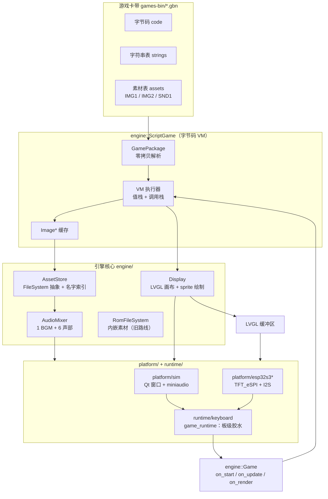

# FunAIGameEngine 架构与使用说明

> 面向两类读者：
> * **想加/改游戏的人** —— 看 [§4 使用说明](#4-使用说明)，绝大多数情况下**完全不用碰固件**。
> * **想改引擎本身的人** —— 看 [§2 分层](#2-分层架构)、[§5 已知问题](#5-已知问题与陷阱)、
>   [§6 改动检查清单](#6-改动检查清单)。
>
> 分项细节不在这里重复：语言与指令集 → [`SCRIPT.md`](SCRIPT.md)，
> C++ API → [`ENGINE_API.md`](ENGINE_API.md)，按键 → [`INPUT.md`](INPUT.md)，
> 素材命名与格式 → [`ASSETS.md`](ASSETS.md)，给 AI 的约束 → [`AI_GAMEDEV_GUIDE.md`](AI_GAMEDEV_GUIDE.md)。

---

## 1. 一句话定位

**一个固定固件 + 可加载的游戏文件。换游戏不需要重烧固件。**

一台键盘只烧一次固件；之后往 `data/` 丢一个 `.gbn` 卡带、在货架上加一行条目，游戏就出现了。
卡带 = **字节码 + 全部素材**（图、音）打在一个文件里，用同一个容器装脚本游戏和纯素材游戏。

设计目标按优先级：

1. **换游戏不动固件** —— 游戏逻辑和素材都在卡带里。
2. **卡带要小** —— 它住在 SPIFFS 分区（总共 917,504 字节），所以有采样率、素材过滤等硬约束（见 §5.7）。
3. **同一份游戏能在 PC 模拟器和真机上跑出一样的结果** —— 平台差异被 `platform/` 吃掉。
4. **迭代要快** —— 有一整套离线工具（参考 VM、截图、交叉核对），不用烧机就能调。

---

## 2. 分层架构



**关键点：`engine::Game` 是唯一的游戏接口。** 脚本游戏（`ScriptGame`）、原生 C++ 游戏
（`games/<name>/game.cpp`）都只是它的一个实现；平台层不知道也不关心游戏是怎么写的。

### 2.1 目录结构

| 路径 | 作用 |
|---|---|
| `engine/`（自身就是一个标准 **Arduino 库**：`library.properties` + `library.json` + `src/` + `examples/`） | 引擎本体（与平台无关）。头文件与 `.cpp` **都在 `engine/src/engine/`**；**新增 .cpp 必须手动加进 `engine/CMakeLists.txt`**（它是显式列出的，不是 glob） |
| `games/` | 原生 C++ 游戏 + `registry.cpp`（注册表） |
| `games-src/<name>/game.gs` (+ 素材) | **脚本游戏源码**，`build_game.py` 的输入 |
| `games-bin/<name>.gbn` | **产物卡带**，模拟器直接读、固件拷进 `data/` |
| `assets-src/<name>/` | 美术/音频源文件（`.png` / `.wav`，由 `tools/gen_*.py` 生成或手绘） |
| `assets-packed/<name>/` | 打包后的 `.img` / `.snd` |
| `platform/sim/` | Qt 模拟器（窗口、音频、路径） |
| `platform/esp32s3/`、`platform/esp32s3keyboard/` | 实机导出模板 |
| `runtime/keyboard/` | 键盘侧运行库：板级 `read_pad` + 音频后端 + 生命周期 |
| `tools/` | 全部离线工具（Python，纯标准库） |
| `docs/` | 文档 |

---

## 3. 三层数据契约

### 3.1 卡带容器 `.gbn`

```
"GBN1" | u16 version | u16 globalCount
       | u32 initPC | u32 startPC | u32 updatePC | u32 renderPC
       | u32 codeSize | u32 stringCount | u32 assetCount
       | code[]
       | strings[]   : u16 len + utf8 bytes      （没有 NUL 结尾！）
       | assets[]    : u16 nameLen + name + u32 size + bytes
```

**零拷贝**：`GamePackage::parse()` 不复制任何素材，`AssetStore` 直接从包内指针取数据。
所以 `GamePackage` 必须比用它创建的游戏活得久（固件侧卡带常驻 PSRAM）。

* 脚本卡带：`globalCount` 是**内存池大小**（标量 + 数组元素共用，上限 `kMaxGlobals = 2048`）；
  四个入口点指向 `on start / update / render`（`on init` 可选）。
* 纯素材卡带（给原生 C++ 游戏用）：`codeSize = 1`（一条 `HALT` 占位，因为 `parse()` 要求
  `codeSize > 0`），四个入口点全是 `0xFFFFFFFF`，没有字符串表。

### 3.2 素材格式

| 格式 | 布局 | 用途 |
|---|---|---|
| `IMG1` | `"IMG1" + u16 w + u16 h + w*h*2`（RGB565） | 大图 / 颜色多的图；**品红 = 透明** |
| `IMG2` | `"IMG2" + u16 w + u16 h + 16×u16 调色板 + ceil(w*h/2)` | 4bpp 索引图；**索引 0 固定透明**，行间不补齐，高半字节是左边那个像素 |
| `SND1` | `"SND1" + u32 rate + u32 frames + int16[frames]` | 单声道 PCM。**rate 是逐个 clip 生效的**，见 §5.6 |

`pack_assets.py` 自动二选一：**颜色 ≤ 16 且像素 ≤ 4096 → `IMG2`，否则 `IMG1`**
（索引图要逐像素查调色板，大图反而慢）。

> ⚠ **谁自己写像素循环，谁就得同时认两种格式。** 现在有三处：
> `Display::draw_image*`、`AssetStore` 之外的 `blit` 类工具。
> 漏一处那块素材就会变成雪花。

### 3.3 名字解析的一个历史坑（已修，但要知道它的存在）

`.gbn` 里记的素材名**已经带扩展名**（`"muncher_r0.img"`）。`AssetStore::image()/clip()`
曾经又拼了一次 `.img` → 去找 `muncher_r0.img.img` → 永远返回 `nullptr`。
现在靠 `with_ext()`（已带扩展名就不再拼）解决。

同名坑还有一处：`GamePackage::string_at()` 返回的字符串**没有 NUL 结尾**，
直接丢给字符串函数会一路抄到隔壁字节。`parse()` 里另存了一份 `texts_`（`std::string`）来修。

---

## 4. 使用说明

### 4.1 五分钟做一个新游戏（脚本路线）

```bat
cd F:\New_Project\FunAIGameEngine

:: 1) 建目录，写脚本 + 放素材（.png/.wav 会被自动打包，也可以直接放 .img/.snd 复用现成的）
mkdir games-src\mygame
::    games-src\mygame\game.gs
::    games-src\mygame\player.png
::    games-src\mygame\coin.wav

:: 2) 编译 + 打包
py -3 tools\build_game.py mygame

:: 3) 看效果（参考 VM，秒级；--pad 是前一半帧按住哪些键）
py -3 tools\gs_run.py games-src\mygame\game.gs --frames 600 --pad right,a ^
    --globals px,score,lives --png tools\_preview\mygame.png

:: 4) 用真引擎渲染（起 Qt 模拟器 + 抓窗口 + 关掉，一条命令）
py -3 tools\sim_shot.py tools\_preview\sim_mygame.png mygame --zoom 2
```

`on start / on update / on render` 三段就是全部入口，语言细节见 [`SCRIPT.md`](SCRIPT.md)。

### 4.2 迭代循环（建议照这个顺序，别跳步）

```
改 game.gs
   ↓
gs_trace.py      编译报错看完整 traceback（gs_compiler 只打一行，定位自己 bug 不够用）
   ↓
gs_run.py        字节码的 Python 参考实现 + 软件帧缓冲。--globals/--arrays 直接看变量
   ↓
sim_shot.py      真引擎渲染。⚠ 参考 VM 过了**不代表**引擎过了（历史上就是靠这个差异
                 揪出 3 个"参考过、引擎不过"的静默 bug）
   ↓
upload + uploadfs  上机
```

### 4.3 素材流水线

```bat
py -3 tools\engine.py assets        :: assets-src/ -> assets-packed/（自动选 IMG1/IMG2，SND 按策略降采样）
copy assets-packed\mygame\* games-src\mygame\     :: 脚本卡带从 games-src 里取素材
py -3 tools\build_game.py mygame
```

`pack_assets.py` 是**只覆盖不删除**的：改过素材名（比如给动画加帧号）之后，
旧文件会留在 `assets-packed/<game>/` 里。

> 不用手动清它 —— `build_game.py` 现在**只打包脚本真正引用过的素材**（引用集合 = 编译出的
> 字符串表，因为脚本里所有素材名都是字面量），并会把跳过的名字打出来。
> 同名两份（`.png` 和 `.img` 同时存在）也只留一份。见 §5.7。

### 4.4 打包与上机

```bat
:: 卡带
py -3 tools\build_game.py --all

:: 固件侧
copy games-bin\mygame.gbn  f:\New_Project\FunModularKeyboard\firmware\FunModularKeyboard\data\
```

货架条目在固件 `src/ui/ui_GameScreenSecondary.c`：

```c
{ "MY GAME", "SHORT SUBTITLE", true, &ui_img_gamecover_mygame, "mygame" },
//  标题      副标题            可玩   封面（编译进固件的 LVGL 图）  卡带 id
```

封面用 `tools/*_cover_gen.py` 那类脚本生成成 C 数组，加进 `src/ui/`。

上机（`pio` 不在 PATH 上，要用全路径）：

```bat
cd f:\New_Project\FunModularKeyboard\firmware\FunModularKeyboard
"%USERPROFILE%\.platformio\penv\Scripts\platformio.exe" run            :: 编译固件
"%USERPROFILE%\.platformio\penv\Scripts\platformio.exe" run -t buildfs  :: 打包 SPIFFS（装不装得下看这步）
"%USERPROFILE%\.platformio\penv\Scripts\platformio.exe" run -t upload
"%USERPROFILE%\.platformio\penv\Scripts\platformio.exe" run -t uploadfs :: 卡带在 data/，这步不能漏
```

**加了/换了卡带就一定要 `uploadfs`**，否则货架上的游戏点进去打不开。
`buildfs` 报 `File system is full` 就是超容，去看 §5.7。

### 4.5 键盘固件侧怎么接（一次性的事）

固件不链接任何原生游戏实现，只做三件事：

```c
// src/game/game_port.cpp
bool ui_game_launch(const char* id);   // 唯一入口：读 data/<id>.gbn 进 PSRAM -> create_from_cart
```

* `registry.cpp` 的 `create_game()` **恒返回 `nullptr`**（键盘固件里不链接任何原生游戏）；
  一律走 `create_from_cart()`：卡带自带字节码 → `ScriptGame`，否则回落到 `create_game(id)`。
* `AudioMixer::available()` 为真时，游戏音频完全由引擎混音器负责；`MainTask.cpp` 里那套
  `kGameSfxFiles` / `kGameBgmFiles` + `service_game_audio()` 是**混音器不可用时的兜底**，
  正常情况下走不到（见 §5.8）。

> ⚠ `platform/esp32s3*` 和 `runtime/keyboard` 里的引擎代码是 `engine/` 的**拷贝**。
> 改了引擎必须同步过去，否则固件和模拟器行为不一致（§6）。

### 4.6 原生 C++ 路线（备选）

`games/<name>/game.cpp` 实现 `engine::Game`，在 `games/registry.cpp` 注册，
素材用 `build_game.py --cart <name>` 打成纯素材卡带。适合：

* 需要 VM 表达不了的东西（复杂数学、大量状态、性能敏感）；
* 作为移植脚本版时的**规格参考**（`games/fighter/`、`games/skyraider/`、`games/keychase/`
  就留着这个用途）。

代价：**加一个 C++ 游戏要重烧固件**，而脚本游戏不用 —— 这是当初做 VM 的全部理由。

---

## 5. 已知问题与陷阱

按"踩了会有多痛"排序。

### 5.1 VM 的失败模式是**静默**的（最危险）

未知指令、缺损素材、字符串下标越界，默认都**不报错**，只是"画面上少点东西"或
"这段逻辑后面不执行了"。历史上三个 bug 叠在一起、表现成"图片全部消失"。

现在的防线：

* VM 未知指令 → `fprintf(stderr, "[script] 未知指令 0x%02X @ %u")` + **`fflush`** 再停机；
* 贴图找不到 → 打印查的那个名字；
* ⚠ **`fflush(stderr)` 不能省**：stderr 重定向到文件时是块缓冲，进程被 kill 会丢掉全部日志
  （踩过：一度以为"诊断没触发 = 没 bug"）。

**所以：调游戏时永远要看 stderr。** `sim_shot.py` 会把模拟器的 stderr 打出来。

### 5.2 局部变量必须显式 `var`，而且"重复声明 = 另一个槽"

脚本**不自动声明局部变量**，写 `x = 1` 直接编译失败。

真正阴的是这个组合：同一个函数里 `var i = 0` 之后**又出现一次** `var i = ...`，
第二次会给 `i` **新开一个槽** → 循环写

```
var i = 0
while i < 20 { ...; var i = i + 1 }     # ← 条件读旧槽(恒 0)
```

就是**字节码死循环**。如果它在 `on start` 里，表现是**模拟器窗口根本不出现**
（没有报错、没有崩溃，进程还活着）。

定位工具（都在 `tools/`，别删）：

| 工具 | 作用 |
|---|---|
| `_hanggen.py` | 生成带步数看门狗的 `_hangvm.py`，跑它会打印死循环的 **PC** |
| `_listnear.py` | 从 `--listing` 反汇编里打印某个 PC 区间，对照源码 |
| `_hangcheck.py` | faulthandler 看门狗（只能给出卡在哪个 Python 函数，精度不如上面那个） |
| `_fixvar.py` | 批量给首次赋值补 `var`。⚠ **绝对不要对同一文件跑两遍**（第二遍会把 `i = i + 1` 插成 `var i = i + 1`，正是 5.2 那个死循环） |
| `_varfix2.py` | 上一条真跑重了，用它修回来 |

### 5.3 脚本语言的表达力边界

* **函数**：必须定义在调用之前；不能嵌套；**不支持递归**；参数不能是字符串；数组不能当参数传。
  每个函数一块固定内存槽（返回值+参数+局部），只有一个返回地址栈。
* **没有三目运算符** `? :` —— 写成 `if`。
* **`break` / `continue`** 支持（`break` 写在循环外会编译报错）。但没有 `goto`，
  复杂状态机用 `while` + 标志变量更清楚。
* **没有 `sin/cos`** —— 需要摆动/旋转就查表（fighter 的眩晕星用 8 向表，震屏用帧奇偶）。
* **运算符优先级**：比较**比位运算更松**。所以位运算永远加括号：`(x & 1) == 0`，别写 `x & 1 == 0`。
* **类型是静态推导的**，只有 int / float32 两种，同一个 32 位 cell 存 IEEE 位模式、**没有 tag**，
  整型指令和浮点指令不能混用。`fn f(p, q = 0.0) -> 0.0`：写了默认值 = 浮点参数；
  **返回类型忘了写 `-> 0.0` 会静默截断成整数**（踩过）。

### 5.4 素材名是编译期字面量

* `img("name", x, y, flip)` → `IMG`/`IMGF`；`img(strs[i], x, y, flip)` → `IMGV`。
  运行时要换帧名（动画）就必须用 `strs` 字符串数组。
* **`imgw()` / `imgh()` 只接受字符串字面量**，不能 `imgw(strs[i])`。
  所以要按名字算图片尺寸的地方只能写死名字分支。
* **`text()` 的第 3 个参数必须是字符串字面量** —— 动态文字（分数、关卡号）要用
  `textnum()`，或者用编号 + if 分支选字面量（fighter 的横幅就是这么做的）。

### 5.5 变量名会遮蔽按键常量

`up / down / left / right / a / b / c / d / start / select / l / r / x / y` 是按键常量。
解析器只在"没有同名变量"时才当按键，所以 `var x = 0` 之后 `pressed(x)` 就变成读变量了。
**别把变量取这些名字。**

### 5.6 音频：混音器按 clip 自己的采样率取样

`AudioMixer` 的输出采样率固定（模拟器/实机是 22050），但**每个 clip 自带 `rate`**，
播放时按 `clip->rate / 输出采样率` 的步长取样（`step_of()`）。所以素材可以存 11025 Hz
而**时长和音高不变**（零阶保持上采样）。

> 这条是实现"卡带瘦身"的前提。改之前混音器**完全忽略** `clip->rate`、每个输出帧固定前进
> 1 个样本 —— 那时把 rate 调小就会变成半速 + 降八度。

音量/打断策略：1 条 BGM 循环 + 6 条音效声部；同一段音效还在前半段时不再叠加。

### 5.7 卡带体积：SPIFFS 是稀缺资源

* SPIFFS 分区 **917,504 字节**（`0x310000` 起），实际可用约 **844 KB**。
* 当前 `data/` 约 **565 KB**（三卡带 90,045 / 199,011 / 212,489 + 开机音 + 配置）。
* 固件（app0 3 MB）用了 **90.5%**，只剩 ~300 KB。

**两条由构建强制的不变量**（都在 `build_game.py` / `pack_assets.py`，不靠人记）：

1. **音频采样率 ≤ 11025 Hz** —— 策略源是 `tools/sndlib.py` 的 `MAX_RATE`。
   `pack_assets.pack_wav()` 直接按这个率输出（源头就是瘦的），`build_game.py` 对任何进卡带的
   `.snd` 再过一道 `limit()` 兜底。要恢复全质量就把 `sndlib.MAX_RATE` 和
   `pack_assets.SND_RATE` 一起改回 22050。
2. **只打包脚本真正引用过的素材**（引用集合 = 编译出的字符串表），**同名两份只留一份**
   （`.png`/`.wav` 源优先，`.img`/`.snd` 兜底）。

超容时的表现是 `buildfs` 报 `File system is full`。诊断工具：
`_strcheck.py`（某名字在不在引用集合）、`_prune_twins.py`（删冗余孪生文件）、
`_dirsum.py`（看目录构成）。

### 5.8 两套音频系统并存

`Speaker` / `game_audio`（ESP32-audioI2S，播 `data/*.wav`）和 `engine::AudioMixer`
（自己写 I2S）**抢同一个 I2S 外设**。切游戏时"库正在写 I2S + 混音器重建驱动"会竞态，
库的 `playChunk()` 写不进去会 `while(1)` 自旋，**直接卡死整个键盘任务**。

现在的约定写在 `service_game_audio()` 开头：**混音器可用时立刻 return**，
游戏音频完全归混音器管。`data/` 里那批 `sfx_*.wav` / `bgm_*.wav` 是兜底路径的素材，
正常情况用不到（音效和 BGM 都已经在卡带里了）。

### 5.9 内嵌素材（`RomFileSystem`）是旧路线

`engine/src/rom_assets_data.h` + `tools/embed_assets.py` 可以把素材**编进固件**
（找不到卡带时的兜底）。代价是 `rom_assets_data.h.stamp` 变了就触发重编、而且占 flash。
键盘固件现在**不走这条路**（`create_game()` 恒返回 `nullptr`），但引擎仓库里还留着，
模拟器下拉框和"素材源"诊断会用到 `games/registry.cpp` 的注册表。

### 5.10 模拟器收不到键盘输入

`QWidget` 默认 `focusPolicy` 是 `Qt::NoFocus` → 窗口能显示但 `keyPressEvent` 永不触发。
已在 `platform/sim` 的构造函数里 `setFocusPolicy(Qt::StrongFocus); setFocus();`。
调试按键用 `FUNSIM_KEYLOG=1` 启动。

另外：`sim_shot.py` 抓到的是**窗口内容**（`PrintWindow`），所以不怕被别的窗口挡住；
但直接起 `fun_sim.exe` 会以 `0xC0000135`（STATUS_DLL_NOT_FOUND）秒退，
必须把 `C:\Qt\6.9.3\mingw_64\bin` 和 `C:\Qt\Tools\mingw1310_64\bin` 加进 PATH
（`sim_shot.py` 已经处理）。

### 5.11 模拟器没有输入 → 只做**渲染**验证

`sim_shot.py` 不能送按键，所以停在选人/菜单界面是正常的。要验证"对打中/关卡中"的画面，
只能临时在 `on start` 里跳过菜单拍一张，拍完改回来。**逻辑验证靠 `gs_run.py`**（它有 `--pad`）。

---

## 6. 改动检查清单

### 6.1 加/改一条 VM 指令或内置函数 —— **要同步 4 处**

| # | 文件 | 改什么 |
|---|---|---|
| 1 | `tools/gs_compiler.py` | 顶部 opcode/内置函数 id 表（权威编号就在这里） |
| 2 | `engine/src/ScriptGame.cpp` | VM 的执行分支 |
| 3 | `tools/gs_run.py` | Python 参考实现 |
| 4 | `docs/SCRIPT.md` | 指令表/语言说明 |

漏了 3 → 参考 VM 会静默跑错；漏了 2 → **引擎静默停机**（以前就是这样丢掉一整段 `on start` 的）。

### 6.2 改了 `engine/` 里的任何东西 → 同步进固件

```bat
copy /y engine\src\engine\<X>.h    f:\...\firmware\FunModularKeyboard\lib\FunAIGameEngine\src\engine\
copy /y engine\src\engine\<X>.cpp  f:\...\lib\FunAIGameEngine\src\engine\
```

然后**逐字节核对**：`fc /b <引擎文件> <固件副本>`。
`.cpp` 不一致 = 固件和模拟器行为分叉，而且不会有任何报错。

> 固件里 `src/` 按 **C++11** 编译，只有 `lib/` 是 **C++17**（`library.json` 里给的 `-std=gnu++17`）。
> 带默认成员初始化器的 struct 在 C++11 里**不算聚合**，不能用 `{"name"}` 初始化。

### 6.3 加了新游戏 → 复查这几条

- [ ] `build_game.py <name>` 成功，`print_audio` 显示 `@11025Hz` 且没有"跳过"警告（除非确实要跳）
- [ ] `build_game.py` 没有打印 `!! 有 N 个超过 11025Hz`
- [ ] `gs_run.py` 无 `[!]` 问题
- [ ] `sim_shot.py` 画面正常
- [ ] 卡带拷进 `data/`、货架条目改好、`buildfs` 成功
- [ ] **`uploadfs` 也烧了**

---

## 7. 现状速查（2026-09）

| 项目 | 值 |
|---|---|
| 引擎版本 | **v1.0.1** —— 唯一来源 `engine/include/engine/Version.h`（固件进游戏时串口打印） |
| 脚本游戏 | `keychase`（吃豆人）、`skyraider`（横版射击）、`fighter`（1v1 格斗） |
| 卡带 | 90,045 / 199,011 / 212,489 字节 |
| `data/` 合计 | ~565 KB（可用 ~844 KB） |
| 固件 | `pio run` Flash 90.5%、RAM 31.3% |
| 分区 | `partitions-4MB.csv`：nvs / otadata / app0 3 MB / spiffs 896 KB / license |
| 平台 | 模拟器 Qt 6.9.3 MinGW；实机 ESP32-S3（NV3007 428×142 画布） |

---

## 8. 相关文档

| 文档 | 内容 |
|---|---|
| [`SCRIPT.md`](SCRIPT.md) | 脚本语言、指令表、`.gbn` 格式（**权威**） |
| [`ENGINE_API.md`](ENGINE_API.md) | C++ API：生命周期 / `Engine` / `Display` / 音频 / 存档 |
| [`INPUT.md`](INPUT.md) | `engine::Button` 枚举与按键语义 |
| [`ASSETS.md`](ASSETS.md) | 素材目录约定、命名规则、格式选择 |
| [`AI_GAMEDEV_GUIDE.md`](AI_GAMEDEV_GUIDE.md) | 让 AI 写游戏时的约束与检查清单 |
